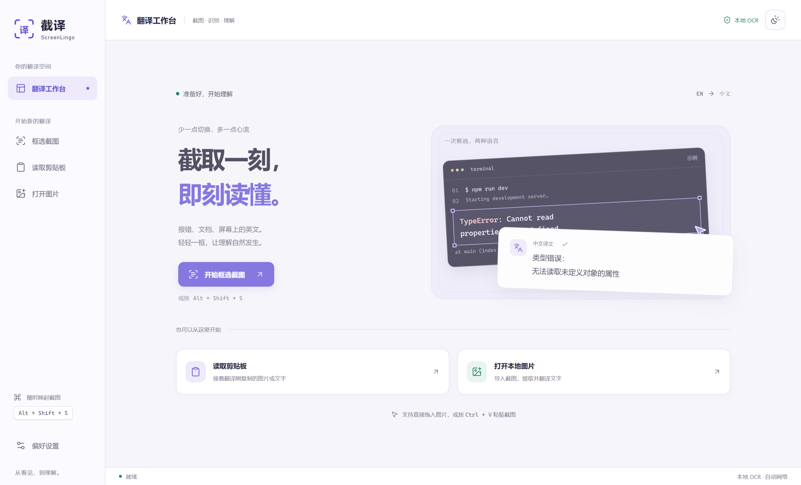
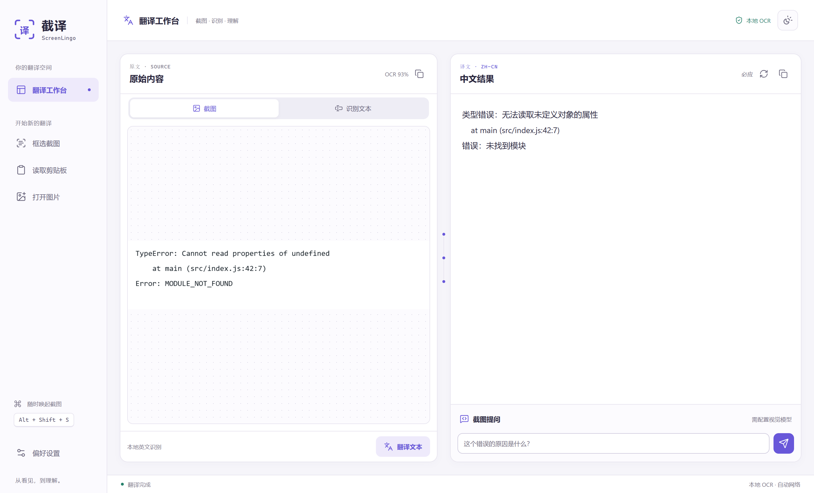

# 截译 ScreenLingo

[English](README.en.md) | 简体中文

面向中文开发者的 Windows 本地 OCR 报错翻译与截图诊断工具。

> 当前版本是 **v0.1 公开测试版**，适合个人试用和参与改进。程序尚未使用商业代码签名，首次启动时 Windows SmartScreen 可能提示“未知发布者”。



## 下载

从 [GitHub Releases](../../releases/latest) 下载最新版本。发布页提供两种 Windows x64 包：

| 版本 | 适合场景 | 使用方式 |
| --- | --- | --- |
| **`ScreenLingo-<版本>-win-x64.zip`（推荐）** | 日常使用，启动更快 | 完整解压后运行 `截译 ScreenLingo.exe`，不要单独移动 EXE |
| **`ScreenLingo-<版本>-x64.exe`** | 临时携带，只保留一个文件 | 直接运行；每次启动需要先解压，速度会比 ZIP 版慢 |

建议同时核对发布页中的 SHA-256 校验值。由于测试版尚未签名，请只从本项目的 Releases 页面获取程序。

## 能做什么

- 按 `Alt+Shift+S` 框选终端、编辑器或日志窗口中的英文报错，本地 OCR 后翻译成中文。
- 先复制文字，再按 `Alt+Shift+T` 翻译剪贴板内容。
- 打开、粘贴或拖入 PNG、JPEG、WebP、BMP 图片，校对 OCR 原文后重新翻译。
- 配置支持图片的 OpenAI 兼容模型后，针对当前截图继续提问。
- 自动适配 v2rayN 已开启和未开启两种网络环境，也可手动选择系统代理、直连或本机代理。



## 快速使用

1. 从 Releases 下载并启动程序。
2. 在任意程序中按 `Alt+Shift+S`，拖动框选报错区域。
3. 松开鼠标后，ScreenLingo 会在本机识别英文，并通过所选翻译服务显示中文结果。

按 `Esc` 可取消框选。快捷键被其他程序占用时，ScreenLingo 会保留原设置并给出提示，可在设置页更换快捷键。关闭主窗口后默认驻留系统托盘；可在设置中关闭这一行为。

### 为什么没有注入全局右键菜单

Windows 没有一个能稳定注入所有编辑器、终端和桌面程序的统一“右键翻译”接口。强行实现通常需要全局鼠标 Hook、模拟复制或向其他进程注入代码，容易与终端快捷键、安全软件和不同权限级别冲突。

因此当前版本采用两个可预测的入口：截图热键，以及“先复制、再按热键”的剪贴板翻译。浏览器网页若需要原生右键入口，更适合由独立浏览器扩展实现。

## 翻译与网络

### 免密在线翻译

默认使用必应翻译，只发送 OCR 得到的文字，不发送截图，无需 API Key；也可在设置中切换 Google。

**必应和 Google 模式使用的是非官方网页接口，不是受支持或有稳定性承诺的商业 API。** 它们可能随时出现限流、验证码、区域限制或接口变化，也可能受对应服务条款约束。若需要可控的生产级服务，请改用自己信任的 OpenAI 兼容端点。

### 有 / 无 v2rayN 代理

默认网络模式为“自动”，每次翻译都会重新检测，无需重启 ScreenLingo：

- 开着 v2rayN：优先使用当前系统代理；系统代理未启用时，尝试设置中的本机代理以及常见的 SOCKS5 `127.0.0.1:10808`、HTTP `127.0.0.1:10809`。
- 没开代理：本机代理端口不可用时直接联网。默认必应通常可在国内网络使用；Google 通常需要可用代理。
- 设置中还可强制使用“系统代理”“直连”或“手动代理”。v2rayN 使用其他端口时，请填写实际本机监听地址。
- “检测代理”只说明所选路由可连接，不代表远端翻译服务一定可用。代理节点失效时会明确报错，不会自动绕过已选代理重发内容。
- 本机 Ollama 等回环地址始终直连。程序不会启动、关闭或修改 v2rayN，不会读取其节点、订阅或密钥，也不会修改 Windows 系统代理。

必应国内页在部分代理出口会跳转国际站。程序只尝试固定的国内和国际必应地址，不跟随任意跨地址重定向；取得有效会话前不会发送用户文字。

### OpenAI 兼容服务与截图提问

支持 OpenAI API、兼容网关以及本机 Ollama。远程地址必须使用 HTTPS；只有 `localhost`、`127.0.0.1` 或 `::1` 允许 HTTP。

本机 Ollama 的常见配置：

```text
端点：http://127.0.0.1:11434/v1
文本模型：填写已安装的文本模型名称
视觉模型：填写已安装且支持图片的模型名称
API Key：本机 Ollama 通常可以留空
```

只有主动使用“截图提问”时，当前图片才会发送到所配置的视觉模型端点。切换到不同端点来源时，已保存的 API Key 会被清除，避免旧密钥误发到新服务。

## 隐私与安全

- OCR 使用随程序提供的英文 Tesseract 模型，在本机 Worker 中执行，不访问 CDN。
- 程序不会持续监听剪贴板，只在用户主动触发时读取一次。
- 截图默认只保存在内存中，不自动写入磁盘。
- 默认翻译只上传识别后的文字；只有主动使用截图提问时才上传图片。
- API Key 通过 Electron `safeStorage` 使用 Windows 系统加密能力保存；安全存储不可用时拒绝保存，不会降级为明文。
- 网络请求拒绝跨地址重定向，并限制响应大小。
- 图片进入 OCR 前会检查压缩大小、格式、尺寸和总像素，避免异常图片耗尽内存。

完整数据流见 [隐私说明](docs/PRIVACY.md)。发现安全问题时，请按 [安全策略](SECURITY.md) 中的方式私下报告，不要先创建公开 Issue。

## 当前限制

- 随包 OCR 模型只识别英文，主要针对英文代码报错；无需 OCR 时可直接粘贴文字。
- 默认翻译仍依赖在线服务。完全离线翻译需要另行安装本地模型，并通过 OpenAI 兼容接口连接。
- OCR 对过小、模糊、透明特效或强压缩文字可能不准确；缩小框选范围通常会改善结果。
- 测试版没有自动更新功能，请从 Releases 页面手动获取新版本。

## 从源码运行

需要 Windows 10/11 x64、Git，以及 Node.js 20 或更新版本。

克隆仓库并进入 `ScreenLingo` 目录后运行：

```powershell
npm ci
npm test
npm run check
npm run test:e2e
npm start
```

构建解压目录和单文件便携版：

```powershell
npm run pack
npm run dist
```

构建结果位于 `dist/`。OCR 英文模型会复制到 `resources/tessdata/`，运行时不需要下载模型。

`npm run test:network` 是可选的真实联网测试，只发送脚本内固定的示例报错，覆盖必应直连、自动代理及 Google 自动代理；它不会读取用户剪贴板或发送桌面截图。

维护发布材料时可运行：

```powershell
npm run notices
npm run screenshots
npm run release:check
```

## 参与项目

提交代码前请阅读 [贡献指南](CONTRIBUTING.md)。新功能最好先通过 Issue 说明使用场景；翻译服务相关改动需要同时说明隐私边界和失败行为。

项目在实现前及公开准备阶段研究了 Pot、CopyTranslator、STranslate、eSearch、Umi-OCR、PaddleOCR、Tesseract 和 Argos Translate 等项目，没有复制 GPL 项目的应用代码。详见 [开源调研](docs/OPEN_SOURCE_RESEARCH.md)。

ScreenLingo 采用 [MIT License](LICENSE)。完整生产依赖及许可证见 [第三方声明](THIRD_PARTY_NOTICES.md)。
